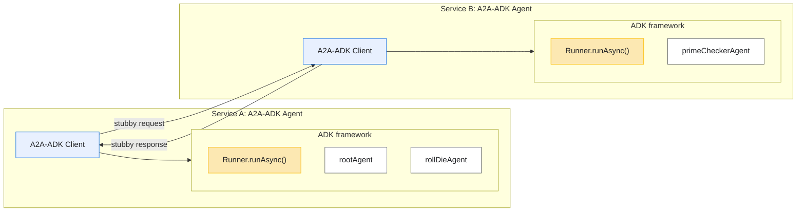

# A2A Runtime and Spring Webservice

This directory contains both the transport-agnostic runtime that maps between
ADK and the A2A specification, as well as the Spring Boot webservice and sample
projects that demonstrate how to expose that runtime over HTTP.

### Module Boundaries

- `com.google.adk.a2a.converters` – pure conversion helpers between ADK events and
  A2A spec payloads; entirely framework- and transport-agnostic.
- `com.google.adk.a2a.A2ASendMessageExecutor` and `RemoteA2AAgent` – runtime
  entry points that orchestrate sendMessage flows using the converters; they
  remain service-framework agnostic but expect a transport-specific client to
  be supplied.
- `com.google.adk.a2a.A2AClient` – default HTTP implementation backed by the
  A2A SDK; swap this out when binding the runtime to another transport.
- `a2a/webservice` – Spring Boot transport module that imports the runtime
  library and exposes the JSON-RPC endpoint.

### High‑Level Picture


### Core Runtime Components

- `A2ASendMessageExecutor` walks the full sendMessage lifecycle: converts the
  inbound spec message into ADK events, ensures session state, invokes the
  agent (either via a provided strategy or an owned `Runner`), applies timeout
  handling, and converts the resulting events back into a single spec
  `Message`. All logging and fallback responses live here to keep transport
  shells minimal.
- `RemoteA2AAgent` resolves `AgentCard` metadata (card object, URL, or file),
  constructs/owns an `A2AClient` when needed, builds the JSON-RPC request, and
  fans the `SendMessageResponse` back into ADK events using the converters.
- `A2AClient` is strictly an HTTP helper: it serialises the request with
  Jackson, posts via `A2AHttpClient`, and deserialises the response. Swap it for
  a gRPC client without touching the rest of the package.
- `AgentCard` refers to the spec record in `io.a2a.spec`; we reuse that
  builder for discovery metadata so clients and services share the same view.
- `converters/*` hold all mapping logic: `RequestConverter` generates ADK
  events from spec messages, `ResponseConverter` performs the reverse and wraps
  results, `PartConverter` translates individual parts, and
  `ConversationPreprocessor` splits prior history versus the user turn. Nothing
  in here depends on any transport framework.

None of these classes depend on Spring or JSON-specific wiring (apart from the
sample HTTP client), so they can be imported directly by other transports or
tools.

### Webservice Module Layout

The `a2a/webservice` module packages the Spring Boot transport that exposes the
REST endpoint:

- `A2ARemoteApplication` – Spring Boot entrypoint that boots the Tomcat server
  and wires in the remote configuration.
- `A2ARemoteConfiguration` – Spring `@Configuration` that imports the transport
  stack and the shared `A2ASendMessageExecutor`. Provide a `BaseAgent` bean to
  handle requests locally (as the `a2a_remote` sample does).
- `A2ARemoteController` – JSON-RPC adapter mounted at `/a2a/remote/v1`.
- `A2ARemoteService` – delegates incoming requests to the executor and handles
  JSON-RPC error responses.
All application wiring lives in this module; the core A2A logic remains in the
transport-agnostic `a2a/src/...` tree described above.

### Samples

- `contrib/samples/a2a_basic` – minimal HTTP client demo that hits a remote
  A2A endpoint and logs the JSON-RPC exchange. Useful for verifying the
  transport without standing up the full Spring service.
- `contrib/samples/a2a_remote` – standalone Spring service mirroring the
  Stubby demo. It depends on the shared `a2a/webservice` module so the sample
  only provides the prime-agent wiring while reusing the production controller
  and service stack.

### Quick Start

All commands below assume you are in `google_adk`.

1. **Start the Spring webservice sample** (run in its own terminal)
   ```bash
   lsof -ti :8081 | xargs -r kill
   ./mvnw -f contrib/samples/a2a_remote/pom.xml spring-boot:run \
     -Dspring-boot.run.arguments=--server.port=8081
   ```

   Background option:
   ```bash
   nohup env GOOGLE_GENAI_USE_VERTEXAI=FALSE \
     GOOGLE_API_KEY=your_api_key \
     ./mvnw -f contrib/samples/a2a_remote/pom.xml spring-boot:run \
     -Dspring-boot.run.arguments=--server.port=8081 \
     > /tmp/a2a_webservice.log 2>&1 & echo $!
   ```
   The log can be found at /tmp/a2a_webservice.log.

2. **Run the basic client sample (`a2a_basic`)** (from another terminal)
   ```bash
   GOOGLE_GENAI_USE_VERTEXAI=FALSE \
   GOOGLE_API_KEY=your_api_key \
   ./mvnw -f contrib/samples/a2a_basic/pom.xml exec:java \
     -Dexec.args="http://localhost:8081/a2a/remote"
   ```

   The client logs the outbound JSON-RPC payload and shows the remote agent’s
   reply (for example, `4 is not a prime number.`).

   > The first run downloads dependencies from Maven Central. Configure a
   > mirror in `~/.m2/settings.xml` if your environment restricts outbound traffic.

   Background option:
   ```bash
   nohup env GOOGLE_GENAI_USE_VERTEXAI=FALSE \
     GOOGLE_API_KEY=your_api_key \
     ./mvnw -f contrib/samples/a2a_basic/pom.xml exec:java \
     -Dexec.args="http://localhost:8081/a2a/remote" \
     > /tmp/a2a_basic.log 2>&1 & echo $!
   ```
   Tail `/tmp/a2a_basic.log` to observe subsequent turns.

To build the runtime, Spring webservice, and both samples together, activate the
opt-in Maven profile:

```bash
./mvnw -pl a2a -am clean package
```

#### Manual Smoke Test

With the server running locally you can exercise the endpoint with `curl`:

```bash
curl -X POST http://localhost:8081/a2a/remote/v1/message:send \
  -H "Content-Type: application/json" \
  -d '{
        "jsonrpc": "2.0",
        "id": "cli-check-2",
        "method": "message/send",
        "params": {
          "message": {
            "kind": "message",
            "contextId": "cli-demo-context",
            "messageId": "cli-check-2",
            "role": "USER",
            "parts": [
              { "kind": "text", "text": "Is 2 prime?" }
            ]
          }
        }
      }'
```

Use a fresh `id`/`messageId` for each attempt if you want the request/response
pair logged distinctly. Dropping the `contextId` is fine—the service will
generate a UUID and return it in the response.

Sample response:

```json
{
  "jsonrpc": "2.0",
  "id": "cli-check-6",
  "result": {
    "role": "agent",
    "parts": [
      {
        "data": {
          "args": { "nums": [6] },
          "name": "checkPrime"
        },
        "metadata": { "type": "function_call" },
        "kind": "data"
      },
      {
        "data": {
          "response": { "result": "No prime numbers found." },
          "name": "checkPrime"
        },
        "metadata": { "type": "function_response" },
        "kind": "data"
      },
      {
        "text": "No prime numbers found.",
        "kind": "text"
      }
    ],
    "messageId": "36b2a2a4-87c7-4800-b7f7-8e7c73d2f25e",
    "contextId": "cli-demo-context",
    "kind": "message"
  }
}
```
